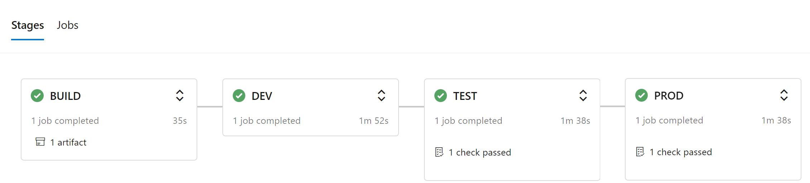

## Deploying Azure Data Factory into 3 separate environments (DEV, TEST, PROD) using Azure DevOps 

# Summary

## Brief

## Services used

- Azure DevOps
- Azure Data Factory

## Prerequisites

- Permissions in Azure DevOps
  - Creating & modifying code/repos
  - Running pipelines
  - Creating service connections
- 3 environments defined in Azure DevOps
  - DEV
  - TEST
  - PROD
- Service connection with permissions to deploy in Azure

## Diagram
 

## Benefits
- Azure Logic Apps are extremely cheap small asynchronous tasks. There is literally 0$ costs involved in just waiting as consumption based (serverless) Logic Apps have no infrasurcture associated with them. 
- No Data Factory cost associated for waiting when using Webhook!
   

## Flow Diagram
  

## Logic App Design
  

# Deployment Steps

1. Create Logic App from ARM template
2. Assign Logic App Managed Identity to Azure Analysis Services as an administrator
3. Get Logic App URL 
4. Add & configure Webhook Activity in Data Factory