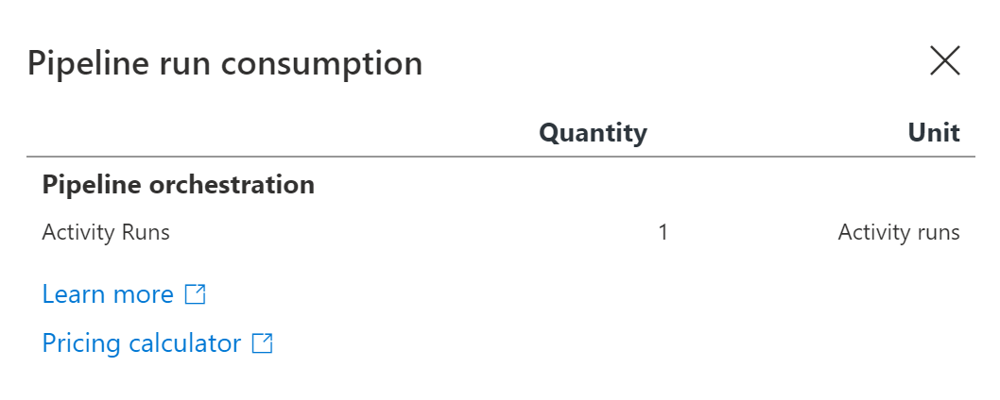
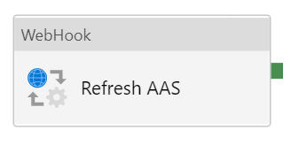
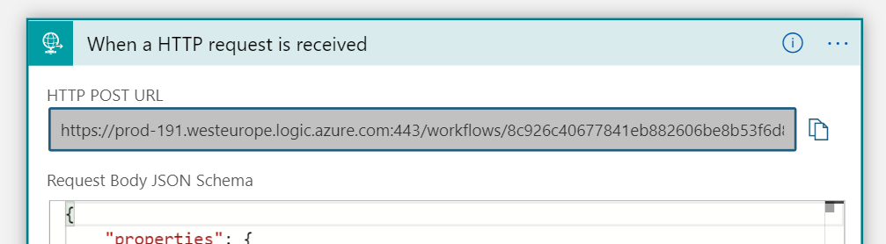
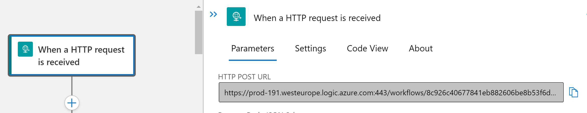
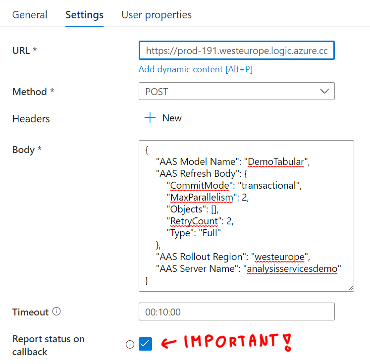
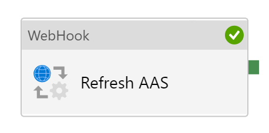

## Refreshing Azure Analysis Services models from Azure Data Factory pipelines

# Summary
This small manual should help data engineers refresh Azure Analysis Services from Azure Data Factory in just few minutes. 
## Brief
This code will refresh Azure Analysis Services model and wait for it's completion using Azure Data Factory Webhook activity to call Azure Logic App.

Alternative approach [using Azure Logic Apps is described here](../refresh-analysis-services-logic-app/index.md).

## Services used

- Azure Data Factory
- Azure Analysis Services

## Prerequisites

- Permissions in Azure to 
  - Deploy ARM templates, and 
  - Admin rights Azure Analysis Services
- At least one model deployed in AAS

## Diagram

## Benefits
- Azure Logic Apps are extremely cheap small asynchronous tasks. There is literally 0$ costs involved in just waiting as consumption based (serverless) Logic Apps have no infrasurcture associated with them. 
- No Data Factory cost associated for waiting when using Webhook!
   

# Deployment Steps

* Deploy **Azure Logic App**
  
  **Hint**: You can use this deploy and provide the name of existing logic app to update it 

  * Option 1 - Deploy using PowerShell (Local or CloudShell)

    ```PowerShell
    New-AzResourceGroupDeployment `
        -ResourceGroupName "<resource_group_name>" `
        -LogicAppName "<name_of_your_logic_app>" `
        -TemplateUri "https://raw.githubusercontent.com/MarczakIO/azure-enterprise-templates/main/data-factory/refresh-analysis-services-logic-app/template.json"
    ```

  * Option 2 - Deploy with ARM template using Azure Portal
  
    [](https://portal.azure.com/#create/Microsoft.Template/uri/https%3A%2F%2Fraw.githubusercontent.com%2FMarczakIO%2Fazure-enterprise-templates%2Fmain%2Fdata-factory%2Frefresh-analysis-services-logic-app%2Ftemplate.json)

  * Option 3 - Using [ARM template](../refresh-analysis-services-logic-app/template.json) manually
  
* Assign Admin permissions for Azure Data Factory
  * Option #1 (Recommended) - Use PowerShell (Local or CloudShell)
  
    ```PowerShell
    New-AzResourceGroupDeployment `
        -ResourceGroupName "<resource_group_name>" `
        -LogicAppName "<name_of_your_logic_app>" `
        -TemplateUri "https://raw.githubusercontent.com/MarczakIO/  azure-enterprise-templates/main/data-factory/  refresh-analysis-services-logic-app/template.json"
    ```

  * Option #2 - Use PowerShell manually script located here [assign-adf-as-aas-admin.ps1](assign-adf-as-aas-admin.ps1)

    * Replace six variables with the ones from your environment
      * $dataFactoryName
      * $dataFactoryResourceGroupName
      * $dataFactorySubscriptionName
      * $analysisServicesName
      * $analysisServicesResourceGroupName
      * $analysisServicesSubscriptionName

  * Option #3 - Use SQL Server Management Studio
    * 

* Open **Azure Data Factory** and add new **Webhook Activity**
  
  

  Configure the setup as follows


  * **URL** - Get URL from Logic App first step.
    
    * Option #1 - via old UI
      
      
  
    * Option #2 - via new UI
      
      
  
    * Option #3 - via PowerShell
      ```PowerShell
      Get-AzLogicAppTriggerCallbackUrl
        -ResourceGroupName <String>
        -Name <String>
        -TriggerName <String>
      ```

  * **Method** POST
  * **Body** - use this template  
    ```json
    {
        "AAS Model Name": "<model_name>",
        "AAS Refresh Body": {
            "CommitMode": "transactional",
            "MaxParallelism": 2,
            "Objects": [],
            "RetryCount": 2,
            "Type": "Full"
        },
        "AAS Rollout Region": "<rollout_region>",
        "AAS Server Name": "<server_name>"
    }
    ```
    *Example*
    ```json
    {
        "AAS Model Name": "DemoTabular",
        "AAS Refresh Body": {
            "CommitMode": "transactional",
            "MaxParallelism": 2,
            "Objects": [],
            "RetryCount": 2,
            "Type": "Full"
        },
        "AAS Rollout Region": "westeurope",
        "AAS Server Name": "analysisservicesdemo"
    }
    ```
    * **Report status on callback** - Checked
      ***Important!*** - This is important to be checked.
    * **Timeout** - Set up maximum time that you expect to refresh to finish in.

* Your Webhook should look as follows
  
* Debug and run it!

   