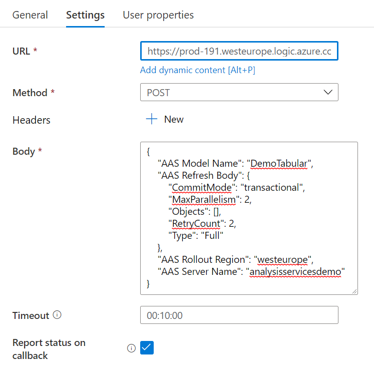

## Deploy to Azure button

[](https://portal.azure.com/#create/Microsoft.Template/uri/https%3A%2F%2Fraw.githubusercontent.com%2FMarczakIO%2Fazure-enterprise-templates%2Fmain%2Flogic-apps-refresh-azure-analysis-services-with-webhook%2Ftemplate.json)

## PowerShell

I advise usage of `deploy.ps1` attached script as it grants Admin permission on Azure Analysis Services. 

## Data Factory Configuration


### Webhook configuration



* **URL** - Get URL from Logic App first step.
  
* **Body** - use this template  
  ```json
  {
      "AAS Model Name": "<model_name>",
      "AAS Refresh Body": {
          "CommitMode": "transactional",
          "MaxParallelism": 2,
          "Objects": [],
          "RetryCount": 2,
          "Type": "Full"
      },
      "AAS Rollout Region":   "<rollout_region>",
      "AAS Server Name": "<server_name>"
  }
  ```
  *Example*
  ```json
  {
      "AAS Model Name": "DemoTabular",
      "AAS Refresh Body": {
          "CommitMode": "transactional",
          "MaxParallelism": 2,
          "Objects": [],
          "RetryCount": 2,
          "Type": "Full"
      },
      "AAS Rollout Region": "westeurope",
      "AAS Server Name":   "analysisservicesdemo"
  }
  ```
  * **Report status on callback** - Checked
    ***Important!*** - This is important to be checked.
  * **Timeout** - Set up maximum time that you expect to refresh to finish in.